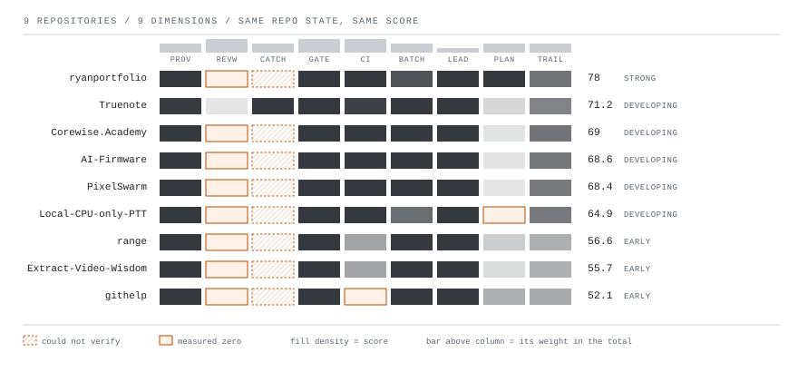
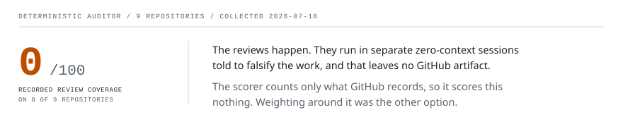
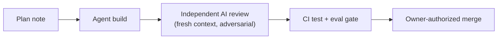

# Agentic-SDLC audit

Point it at any GitHub repo and get a deterministic, scored report on AI-agent development discipline. Same repo state, same score, no LLM anywhere in the scoring path.

It reads GitHub metadata only: commits, pull requests, reviews, check runs, merge events. It never reads the code. So it scores recorded process, not code quality, and discipline that leaves no artifact on GitHub earns nothing.

## The fleet, scored

<picture>
<source media="(prefers-color-scheme: dark)" srcset="assets/matrix-dark.svg">

</picture>

<!-- scoreboard:start -->
| Repo | Score | Grade | Report |
|------|-------|-------|--------|
| ryanportfolio/ryanportfolio | 78/100 | Strong | [report](reports/ryanportfolio.md) |
| ryanportfolio/Truenote | 71.2/100 | Developing | [report](reports/Truenote.md) |
| ryanportfolio/Corewise.Academy (private) | 69/100 | Developing | [report](reports/Corewise.Academy.md) |
| ryanportfolio/AI-Firmware | 68.6/100 | Developing | [report](reports/AI-Firmware.md) |
| ryanportfolio/PixelSwarm (private) | 68.4/100 | Developing | [report](reports/PixelSwarm.md) |
| ryanportfolio/Local-CPU-only-PTT | 64.9/100 | Developing | [report](reports/Local-CPU-only-PTT.md) |
| ryanportfolio/range (private) | 56.6/100 | Early | [report](reports/range.md) |
| ryanportfolio/Extract-Video-Wisdom (private) | 55.7/100 | Early | [report](reports/Extract-Video-Wisdom.md) |
| ryanportfolio/githelp (private) | 52.1/100 | Early | [report](reports/githelp.md) |
<!-- scoreboard:end -->

Collected 2026-07-18. Browse the rendered reports at **[audit.corewise.academy](https://audit.corewise.academy/)**. Most of the portfolio is private: the tool and the pipeline are public and deterministic, and the published reports give a scored read on repos you cannot open, reproducible by the owner from the pinned commit.

## What the orange means

<picture>
<source media="(max-width: 500px) and (prefers-color-scheme: dark)" srcset="assets/strip-narrow-dark.svg">
<source media="(max-width: 500px)" srcset="assets/strip-narrow-light.svg">
<source media="(prefers-color-scheme: dark)" srcset="assets/strip-dark.svg">

</picture>

Recorded review coverage scores 0 on 8 of 9 repos, and review catch rate could not be verified on 8 of 9. Both are true readings, and neither means the work went unreviewed.

Every repo here is solo. Review credit requires a reviewer who is not the pull request's author, and my reviews run as [handoff audits](https://github.com/ryanportfolio/AI-Firmware/blob/main/.claude/skills/handoff-audit/SKILL.md) and [cross-vendor reviews](https://github.com/ryanportfolio/AI-Firmware/blob/main/.claude/skills/codex-review/SKILL.md) in separate sessions, which leave no GitHub artifact. The deterministic scorer cannot see those sessions and gives them no credit, so the review dimensions understate the actual practice.

These are under-measurements, not corrections. Every report states what it could not see instead of guessing, and the weights renormalize around anything unverified rather than scoring it zero by default.

## The scored dimensions

| Dimension | Weight | The question it answers |
|-----------|--------|-------------------------|
| Agent attribution & provenance | 0.1 | Can every commit be traced to who or what made it? |
| Recorded review coverage | 0.15 | How many merged PRs carry a recorded review by someone other than the author? |
| Recorded review catch rate | 0.1 | When a review happened, did it change anything before the merge? |
| Human merge gate | 0.15 | Are merges performed by people, or does automation merge by itself? |
| CI test/eval gate | 0.15 | Do automated tests exist, and did PRs actually pass them before merging? |
| Batch size | 0.1 | Are changes small reviewable chunks, or thousand-line dumps? |
| Lead time (first commit → merge) | 0.05 | How long does work take from first commit to merge? |
| Plan-before-code evidence | 0.1 | Do PRs link to an issue or plan that existed before the code? |
| Audit-trail completeness | 0.1 | Could a stranger reconstruct why each change happened? |

Grades band the weighted average: 90+ Elite, 75+ Strong, 60+ Developing, 40+ Early, under 40 Ad-hoc.

## The experiment

Every change since the bootstrap commit is built **exclusively through the pipeline it documents**:

- The building agent never grades its own work: the reviewing agent gets fresh context and an adversarial prompt, told to refute rather than approve.
- Merge authority stays with the owner. Merges are agent-executed under a standing, session-scoped owner authorization, revocable at any time. That is disclosed, not dressed up as a manual click; details in [governance](governance/README.md).
- Every PR links a plan note, passes the gate, and carries its review trail.

The public PR history of this repo *is* the living demo. Solo project, zero external users. The pitch is publicly auditable process, a reusable framework, and verified portfolio evidence, not adoption.

## Layout

| Path | Purpose |
|------|---------|
| `app/` | The audit tool: scoring engine, collector, CLI, report renderer, site generator (TypeScript / Node 20, GitHub API). |
| `.github/workflows/` | The pipeline itself: test+eval gate, AI-reviewer template. Written to be copy-pastable into other repos. Viewer deploys via Vercel (`vercel.json`). |
| `governance/` | Human-in-the-loop checkpoint map, audit-trail contents, NIST AI RMF mapping, merge-execution disclosure. |
| `plans/` | One plan note per PR, the plan-before-code evidence this tool scores. |
| `reports/` | Published fleet audit reports, live. One per audited repo. Each report was owner-approved before publication. |
| `playbook.md` | How to run this pipeline on any repo. |

## Method

Scores are computed deterministically from GitHub API metadata: same repo state, same score, no LLM in the scoring path. Reports contain aggregate metrics only. No source code, commit-message bodies, PR text, or configuration values are collected or published.
