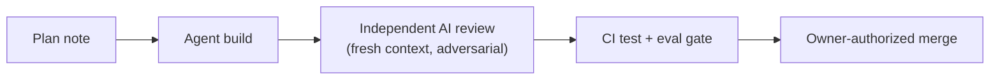

# Ryan Allen

AI systems builder shipping end to end: AI agents do the work, a human gate on every merge. Live systems: [CoreWise](https://corewise.video) (turns videos and articles into actionable insights across multiple AI models), [Truenote](https://truenote.org) (cited knowledge answers for customer-service teams; answers with citations or declines), [willaicite](https://willaicite.com) (free deterministic audit of whether AI answer engines can retrieve and quote your page), and [KineFractal](https://kinefractal.com) (systematic trading). Guides and process notes at [corewise.academy](https://corewise.academy/about).

This repo is the flagship piece: a public, auditable agentic software-development pipeline **and** the audit tool it exists to build.

## Fleet audit scoreboard

*One scored engineering report per repo in the portfolio. Browse the visual viewer at **[ryanportfolio.github.io/ryanportfolio](https://ryanportfolio.github.io/ryanportfolio/)**. Most of the portfolio is private: the audit tool and pipeline are public and deterministic, and the published reports give a scored read on repos you cannot open (reproducible by the owner from the pinned commit). First fleet run lands in Phase 3.*

<!-- scoreboard:start -->
| Repo | Score | Grade | Report |
|------|-------|-------|--------|
| ryanportfolio/ryanportfolio | 78/100 | Strong | [report](reports/ryanportfolio.md) |
| ryanportfolio/local (private) | 71.6/100 | Developing | [report](reports/local.md) |
| ryanportfolio/Truenote | 71.2/100 | Developing | [report](reports/Truenote.md) |
| ryanportfolio/Corewise.Academy (private) | 69/100 | Developing | [report](reports/Corewise.Academy.md) |
| ryanportfolio/AI-Firmware | 68.6/100 | Developing | [report](reports/AI-Firmware.md) |
| ryanportfolio/PixelSwarm (private) | 68.4/100 | Developing | [report](reports/PixelSwarm.md) |
| ryanportfolio/Local-CPU-only-PTT | 64.9/100 | Developing | [report](reports/Local-CPU-only-PTT.md) |
| ryanportfolio/range (private) | 56.6/100 | Early | [report](reports/range.md) |
| ryanportfolio/Extract-Video-Wisdom (private) | 55.7/100 | Early | [report](reports/Extract-Video-Wisdom.md) |
| ryanportfolio/githelp (private) | 52.1/100 | Early | [report](reports/githelp.md) |
<!-- scoreboard:end -->

## What this repo is

An **agentic-SDLC audit tool**: point it at any GitHub repo and get a deterministic, scored report on AI-agent development discipline. Scored dimensions include agent-vs-human commit ratio, PR review coverage and review-catch rate, human merge-gate presence, CI test/eval gate presence and pass history, batch size, commit-to-merge lead time, plan-before-code evidence, and audit-trail completeness, rolled up DORA-style. The scoring core is deterministic: same repo state, same score, no LLM calls in the scoring path.

## The experiment

Every change since the bootstrap commit is built **exclusively through the pipeline it documents**. Each one flows:

- The building agent never grades its own work: the reviewing agent gets fresh context and an adversarial prompt (refute, don't approve).
- Merge authority stays with the owner. Merges are agent-executed under a standing, session-scoped owner authorization, revocable at any time. That is disclosed, not dressed up as a manual click; details in [governance](governance/README.md).
- Every PR links a plan note, passes the gate, and carries its review trail.

The public PR history of this repo *is* the living demo. Solo project, zero external users. The pitch is publicly auditable process, a reusable framework, and verified portfolio evidence, not adoption.

## Layout

| Path | Purpose |
|------|---------|
| `app/` | The audit tool: scoring engine, collector, CLI, report renderer, site generator (TypeScript / Node 20, GitHub API). |
| `.github/workflows/` | The pipeline itself: test+eval gate, AI-reviewer template, Pages deploy. Written to be copy-pastable into other repos. |
| `governance/` | Human-in-the-loop checkpoint map, audit-trail contents, NIST AI RMF mapping, merge-execution disclosure. |
| `plans/` | One plan note per PR, the plan-before-code evidence this tool scores. |
| `reports/` | Published fleet audit reports. *Lands with the Phase 3 fleet run; each report is owner-approved before publication.* |
| `playbook.md` | How to run this pipeline on any repo. |
