<a href="https://fullbuild.ai">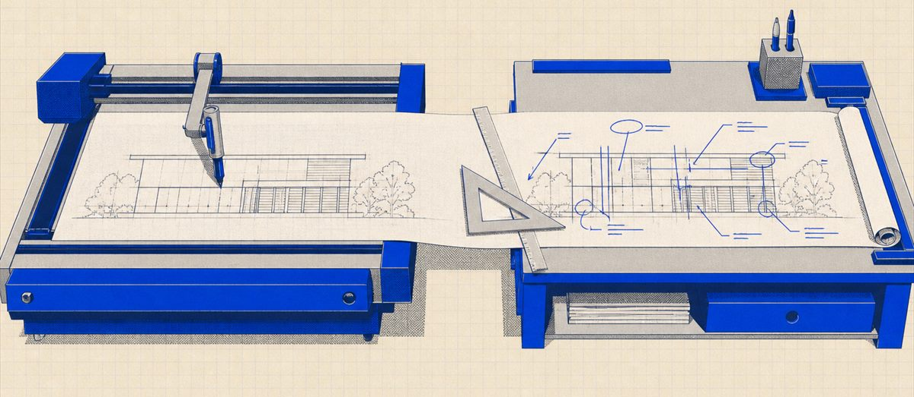</a>

<picture>
<source media="(max-width: 500px) and (prefers-color-scheme: dark)" srcset="assets/masthead-narrow-dark.svg">
<source media="(max-width: 500px)" srcset="assets/masthead-narrow-light.svg">
<source media="(prefers-color-scheme: dark)" srcset="assets/masthead-dark.svg">

</picture>

### Products

<table>
<tr>
<td width="50%">
<a href="https://truenote.org">
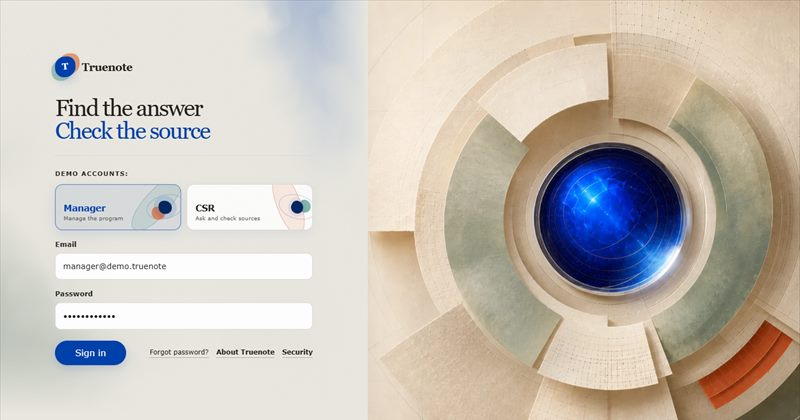
<picture>
<source media="(max-width: 500px) and (prefers-color-scheme: dark)" srcset="assets/card-truenote-narrow-dark.svg">
<source media="(max-width: 500px)" srcset="assets/card-truenote-narrow-light.svg">
<source media="(prefers-color-scheme: dark)" srcset="assets/card-truenote-dark.svg">
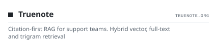
</picture>
</a>
</td>
<td width="50%">
<a href="https://corewise.video">
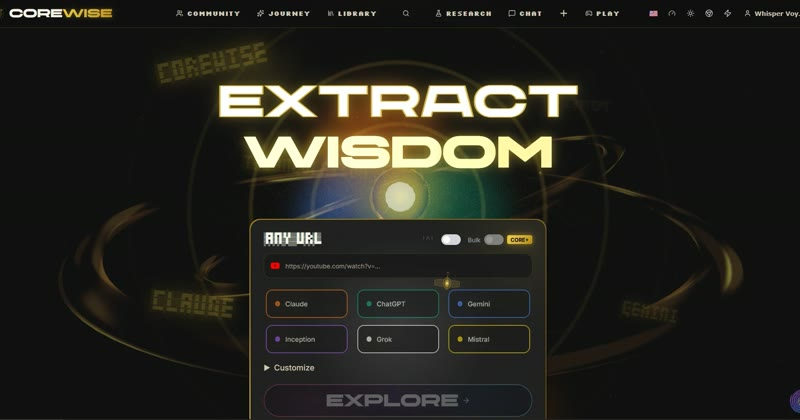
<picture>
<source media="(max-width: 500px) and (prefers-color-scheme: dark)" srcset="assets/card-corewise-narrow-dark.svg">
<source media="(max-width: 500px)" srcset="assets/card-corewise-narrow-light.svg">
<source media="(prefers-color-scheme: dark)" srcset="assets/card-corewise-dark.svg">
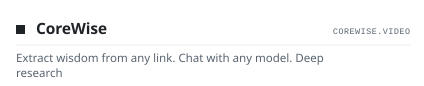
</picture>
</a>
</td>
</tr>
<tr>
<td width="50%">
<a href="https://willaicite.com">
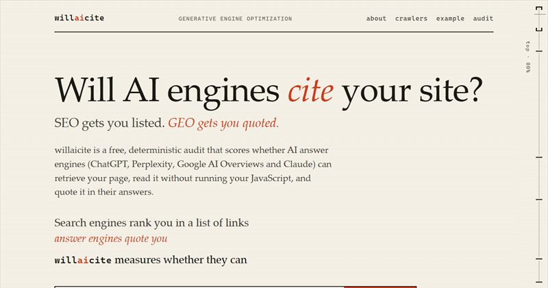
<picture>
<source media="(max-width: 500px) and (prefers-color-scheme: dark)" srcset="assets/card-willaicite-narrow-dark.svg">
<source media="(max-width: 500px)" srcset="assets/card-willaicite-narrow-light.svg">
<source media="(prefers-color-scheme: dark)" srcset="assets/card-willaicite-dark.svg">
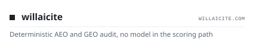
</picture>
</a>
</td>
<td width="50%">
<a href="https://kinefractal.com">
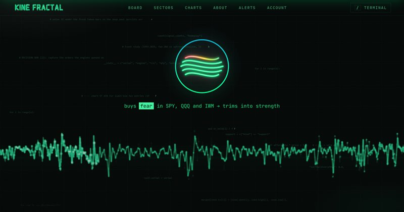
<picture>
<source media="(max-width: 500px) and (prefers-color-scheme: dark)" srcset="assets/card-kine-fractal-narrow-dark.svg">
<source media="(max-width: 500px)" srcset="assets/card-kine-fractal-narrow-light.svg">
<source media="(prefers-color-scheme: dark)" srcset="assets/card-kine-fractal-dark.svg">
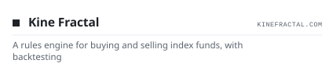
</picture>
</a>
</td>
</tr>
<tr>
<td width="50%">
<a href="https://corewise.academy">
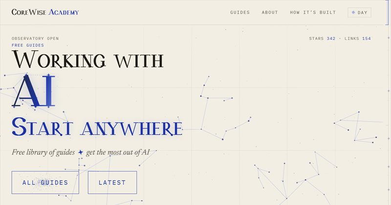
<picture>
<source media="(max-width: 500px) and (prefers-color-scheme: dark)" srcset="assets/card-corewise-academy-narrow-dark.svg">
<source media="(max-width: 500px)" srcset="assets/card-corewise-academy-narrow-light.svg">
<source media="(prefers-color-scheme: dark)" srcset="assets/card-corewise-academy-dark.svg">
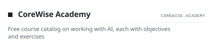
</picture>
</a>
</td>
<td width="50%">
<a href="https://store.steampowered.com/app/4975550/MAIMCOIL">
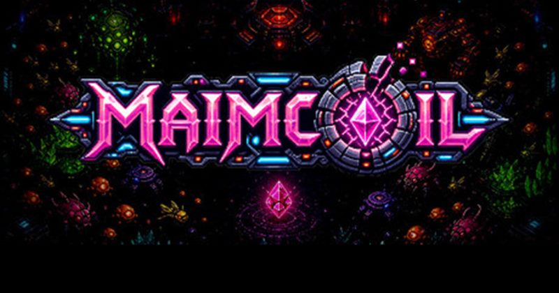
<picture>
<source media="(max-width: 500px) and (prefers-color-scheme: dark)" srcset="assets/card-maimcoil-narrow-dark.svg">
<source media="(max-width: 500px)" srcset="assets/card-maimcoil-narrow-light.svg">
<source media="(prefers-color-scheme: dark)" srcset="assets/card-maimcoil-dark.svg">
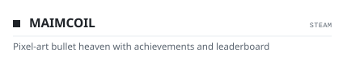
</picture>
</a>
</td>
</tr>
</table>

### Developer tools

<table>
<tr>
<td width="50%">
<a href="https://fullbuild.ai/harness-firmware">
<picture>
<source media="(max-width: 500px) and (prefers-color-scheme: dark)" srcset="assets/card-harness-firmware-narrow-dark.svg">
<source media="(max-width: 500px)" srcset="assets/card-harness-firmware-narrow-light.svg">
<source media="(prefers-color-scheme: dark)" srcset="assets/card-harness-firmware-dark.svg">
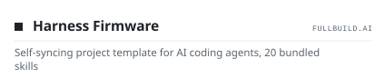
</picture>
</a>
</td>
<td width="50%">
<a href="https://savetokens.tips/stk">
<picture>
<source media="(max-width: 500px) and (prefers-color-scheme: dark)" srcset="assets/card-stk-narrow-dark.svg">
<source media="(max-width: 500px)" srcset="assets/card-stk-narrow-light.svg">
<source media="(prefers-color-scheme: dark)" srcset="assets/card-stk-dark.svg">
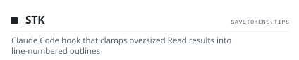
</picture>
</a>
</td>
</tr>
<tr>
<td width="50%">
<a href="https://savetokens.tips">
<picture>
<source media="(max-width: 500px) and (prefers-color-scheme: dark)" srcset="assets/card-savetokens-tips-narrow-dark.svg">
<source media="(max-width: 500px)" srcset="assets/card-savetokens-tips-narrow-light.svg">
<source media="(prefers-color-scheme: dark)" srcset="assets/card-savetokens-tips-dark.svg">
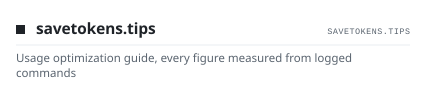
</picture>
</a>
</td>
<td width="50%">
<a href="https://audit.corewise.academy">
<picture>
<source media="(max-width: 500px) and (prefers-color-scheme: dark)" srcset="assets/card-sdlc-audit-narrow-dark.svg">
<source media="(max-width: 500px)" srcset="assets/card-sdlc-audit-narrow-light.svg">
<source media="(prefers-color-scheme: dark)" srcset="assets/card-sdlc-audit-dark.svg">
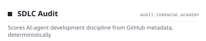
</picture>
</a>
</td>
</tr>
<tr>
<td colspan="2">
<a href="https://ryanportfolio.github.io/tracebench/">
<picture>
<source media="(max-width: 500px) and (prefers-color-scheme: dark)" srcset="assets/card-tracebench-wide-narrow-dark.svg">
<source media="(max-width: 500px)" srcset="assets/card-tracebench-wide-narrow-light.svg">
<source media="(prefers-color-scheme: dark)" srcset="assets/card-tracebench-wide-dark.svg">
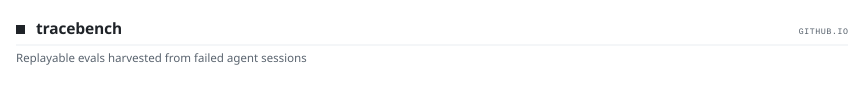
</picture>
</a>
</td>
</tr>
</table>

### Engineering

<table>
<tr>
<td width="50%">
<a href="https://github.com/ryanportfolio/dealstream">
<picture>
<source media="(max-width: 500px) and (prefers-color-scheme: dark)" srcset="assets/card-dealstream-narrow-dark.svg">
<source media="(max-width: 500px)" srcset="assets/card-dealstream-narrow-light.svg">
<source media="(prefers-color-scheme: dark)" srcset="assets/card-dealstream-dark.svg">
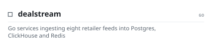
</picture>
</a>
</td>
<td width="50%">
<a href="https://github.com/ryanportfolio/strictcall">
<picture>
<source media="(max-width: 500px) and (prefers-color-scheme: dark)" srcset="assets/card-strictcall-narrow-dark.svg">
<source media="(max-width: 500px)" srcset="assets/card-strictcall-narrow-light.svg">
<source media="(prefers-color-scheme: dark)" srcset="assets/card-strictcall-dark.svg">
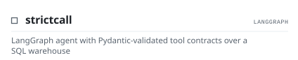
</picture>
</a>
</td>
</tr>
</table>

### Desktop utilities

<table>
<tr>
<td width="50%">
<a href="https://github.com/ryanportfolio/Local-CPU-only-PTT">
<picture>
<source media="(max-width: 500px) and (prefers-color-scheme: dark)" srcset="assets/card-local-ptt-narrow-dark.svg">
<source media="(max-width: 500px)" srcset="assets/card-local-ptt-narrow-light.svg">
<source media="(prefers-color-scheme: dark)" srcset="assets/card-local-ptt-dark.svg">
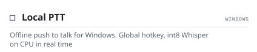
</picture>
</a>
</td>
<td width="50%">
<a href="https://github.com/ryanportfolio/SecureWall">
<picture>
<source media="(max-width: 500px) and (prefers-color-scheme: dark)" srcset="assets/card-securewall-narrow-dark.svg">
<source media="(max-width: 500px)" srcset="assets/card-securewall-narrow-light.svg">
<source media="(prefers-color-scheme: dark)" srcset="assets/card-securewall-dark.svg">
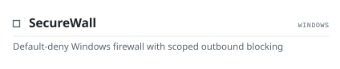
</picture>
</a>
</td>
</tr>
<tr>
<td colspan="2">
<a href="https://github.com/ryanportfolio/ZipFlow">
<picture>
<source media="(max-width: 500px) and (prefers-color-scheme: dark)" srcset="assets/card-zipflow-wide-narrow-dark.svg">
<source media="(max-width: 500px)" srcset="assets/card-zipflow-wide-narrow-light.svg">
<source media="(prefers-color-scheme: dark)" srcset="assets/card-zipflow-wide-dark.svg">
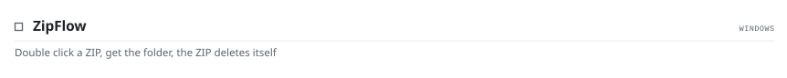
</picture>
</a>
</td>
</tr>
</table>

### Prototypes

<a href="https://fullbuild.ai/prototype">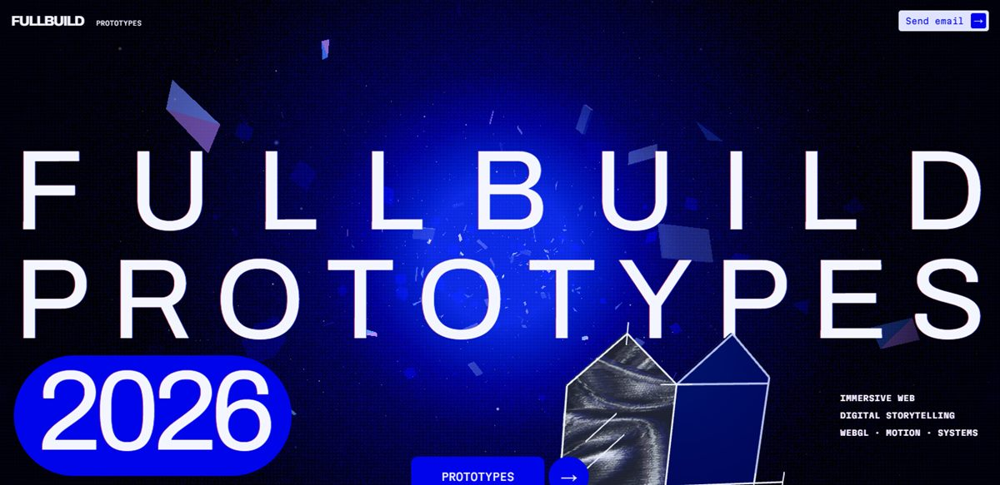</a>

### How the work gets reviewed

The model that wrote the code never grades it.

<a href="https://fullbuild.ai">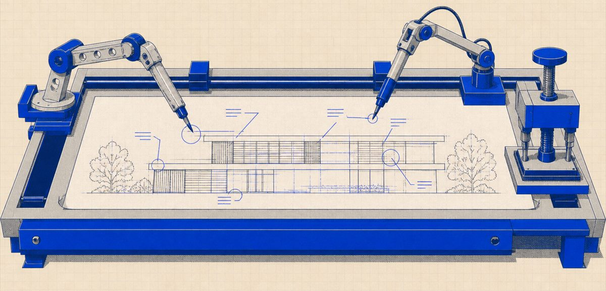</a>

<picture>
<source media="(max-width: 500px) and (prefers-color-scheme: dark)" srcset="assets/review-narrow-dark.svg">
<source media="(max-width: 500px)" srcset="assets/review-narrow-light.svg">
<source media="(prefers-color-scheme: dark)" srcset="assets/review-dark.svg">

</picture>

Both passes are skills I wrote: **[handoff audit](https://github.com/ryanportfolio/AI-Firmware/blob/main/.claude/skills/handoff-audit/SKILL.md)** and **[/codex-review](https://github.com/ryanportfolio/AI-Firmware/blob/main/.claude/skills/codex-review/SKILL.md)**, the newer one, which runs the diff through OpenAI's Codex CLI and verifies every finding before it counts. Then CI, then a merge I authorise. [How I score all of it](AUDIT.md).

Those skills ship with **[Harness Firmware](https://fullbuild.ai/harness-firmware)**, the self-syncing template I start every repo from. The part that does the work is a reference library the agent writes back into: every gotcha that bites once gets recorded as a pitfall, and the next session reads it before touching that area. Knowledge accumulates in the repo instead of evaporating when a session ends.

### Where to go next

[**fullbuild.ai**](https://fullbuild.ai) carries this work with case notes and live prototypes. Background is on my [about page](https://corewise.academy/about).
